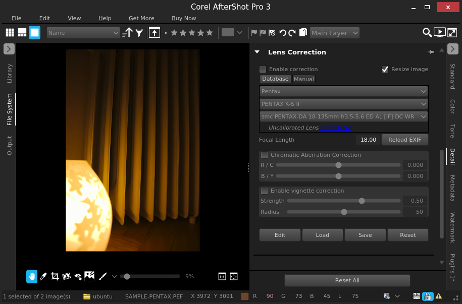

# Corel Aftershot Pro 3 DNG bug
Reproducible example showing a bug within Corel Afetshot Pro 3 when working with DNG files

# Introduction

We are going to demonstrate the bug in a fresh linux box based on the latest Ubuntu 16.04 (Xenial) running inside a virtual machine.
To make the setup reproducible, we use [vagrant](https://www.vagrantup.com/) + [virtualbox](https://www.virtualbox.org/).
The steps involve:
- installing the linux
- downloading and installing Aftershot
- downloading sample DNG and PEF files from the same camera
- running Aftershot

# Prerequisites (inside the host machine)
- **VirtualBox** installed (tested with VirtualBox 5.1)
- **Vagrant** installed (tested with vagrant 1.9.1)

# Installation of a fresh virtual machine
Using vagrant, we setup a fresh linux environment - the latest Ubuntu 16.04 Xenial as follows:

```sh
mkdir corel-bug-vm
cd corel-bug-vm
vagrant init ubuntu/xenial64
vagrant up
vagrant ssh -- -X
```

Now, we are connected to the virtual machine.
(Note: The `-X` option allows us to run applications that require connection to the X server.)

```sh
# we use gdebi tool to install deb files including all dependencies
sudo apt-get --assume-yes install gdebi

# downloading the latest Aftershot
wget http://dwnld.aftershotpro.com/updates/v3/AfterShotPro3.deb

# installing Aftershot (including dependencies)
sudo gdebi --non-interactive AfterShotPro3.deb

# additional requirements for Aftershot (doesn't work without it)
sudo apt-get install libxslt1.1

# now, we download the sample DNG and PEF files to demonstrate the bug
wget https://github.com/vsimko/corel-asp3-dng-bug/raw/master/SAMPLE-PENTAX.DNG
wget https://github.com/vsimko/corel-asp3-dng-bug/raw/master/SAMPLE-PENTAX.PEF

# finally, we can run Aftershot
AfterShot3X64
```

You can also run Afterhost with super-user privileges as suggested by the Corel technical support.
Just use `sudo AfterShot3X64`. However, the bug is still there even when running as root.

# Running Aftershot
In the first dialog, click OK.


In the second dialog, click "Try Corel AfterShot Pro 3".


We can now navigate to the downloaded PEF and DNG files inside the "File System" tab.


Now, we open the PEF image "SAMPLE-PENTAX.PEF" and go to the "Lens Correction" tab.
Here, we can see that Aftershot correctly identified the lens as "smc PENTAX-DA 18-135mm f/3.5-5.6 ED AL [IF] DC WR"



If we do the same with the DNG version "SAMPLE-PENTAX.DNG", we can see that Aftershot did not correctly identify the lens.


# Using exiftool to browse EXIF data from the images

```sh
# first, we need to install exiftool into our VM
sudo apt-get install exiftool
```

Now we can list all metadata containing "lens" string (first PEF, second DNG)
```sh
ubuntu@ubuntu-xenial:~$ exiftool SAMPLE-PENTAX.PEF|grep -i lens
Lens Type                       : smc PENTAX-DA 18-135mm F3.5-5.6 ED AL [IF] DC WR
Lens Focal Length               : 18.1 mm
Lens ID                         : smc PENTAX-DA 18-135mm F3.5-5.6 ED AL [IF] DC WR
```

```sh
ubuntu@ubuntu-xenial:~$ exiftool SAMPLE-PENTAX.DNG|grep -i lens
Lens Type                       : smc PENTAX-DA 18-135mm F3.5-5.6 ED AL [IF] DC WR
Lens Focal Length               : 40.0 mm
Lens ID                         : smc PENTAX-DA 18-135mm F3.5-5.6 ED AL [IF] DC WR
```
